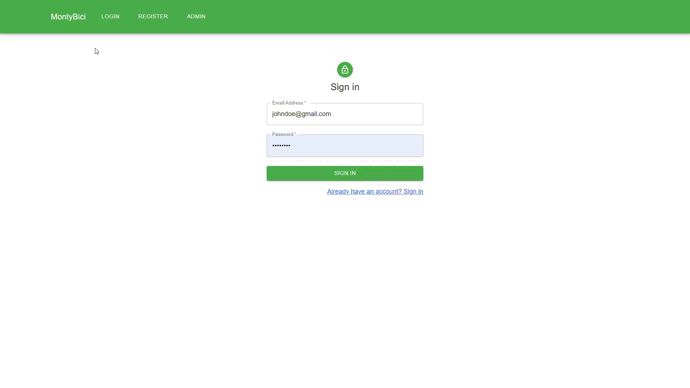
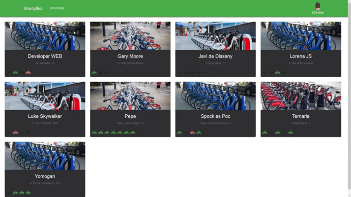
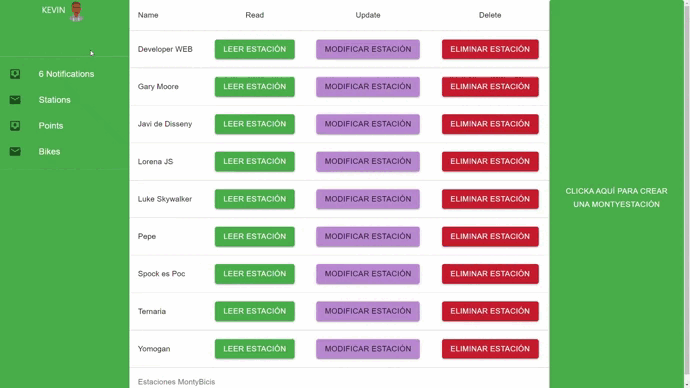
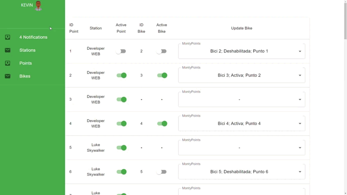
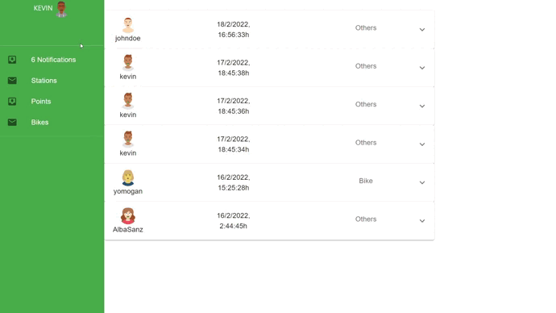

# MontyBici-React_Django-MySQL

Por  [`Kevin Camos Soto`](https://github.com/KevinCamos)

## Table of Contents

1. [MontyBici](#montibici)
2. [Instalar](#Instalar)
3. [Tecnologias](#Tecnologias)

# ¡MontyBici! 💻

Bienvenidas y bienvenidos a MontyBici


`¿Qué es MontyBici-React_Django-MySQL?`

MontyBici es el tercer y último proyecto del curso `2º de DAW`. Realizado  por `KevinCamos` con:

## Vista de usuario

1. **Login:**
   Login user, Login Admin y Register, con la librería  React Hook Form.

2. **Stations:**
   Te facilita una vista sencilla de todas las estaciones y sus bicicletas o slots disponibles, dependiendo de si en ese momento tienes una bicicleta o no.
3. **Details:**
    Te permite obtener una bicicleta siempre y cuando no esté deshabilitada. También te permite dejar una bicicleta en un slot de una estación dependiendo de si está libre y habilitado.
4. **Dashboard:**
   Puedes acceder a datos como el viaje más largo, estación donde coges la bici que más usas al igual que donde la dejas. También te proporciona una tabla con paginación, donde puedes acceder a todos los datos de tus viajes, además de poder enviar a los administradores una incidencia en relación a cualquiera de estos.



##### `Para toda la vista de usuario hay un AuthGuard que solo te permite entrar si eres un usuario de la aplicación`

## Panel Admin

1. **Stations:**
   Te permite crear una estación, añadirle una imagen con fileupload, además de poder añadirle los slots y bicicletas que quieres que tenga cuando se inicie. También te permite modificar y eliminar las estaciones creadas.

2. **Points:**
    Te permite gestionar los slots de las estaciones, activarlos y desactivarlos, activar y desactivar su bicicleta si tiene y además modificar la bicicleta con un select en el que puedes visualizar toda la información sobre ésta.
3. **Bikes:**
    Te permite gestionar el estado de las bicicletas
4. **Notifiactions:**
   Además de poder ver el total de notificaciones por resolver, te ofrece un acordeon con todas las incidencias y todos los datos sobre estas. Al marcarlas como leidas se envía un correo al usuario para notificarle de que se ha tenido en cuenta su mensaje.


##### `Para toda la vista de usuario hay un AuthGuard que solo te permite entrar si eres un ADMINISTRADOR de la aplicación`

## Instalar 💿

---

### `Requisitos`

Tener instalado las siguientes herramientas:

- [MySQL](https://www.mysql.com/)
- [Virtualenv](https://virtualenv.pypa.io/en/latest/) v20.0.17
- [Python](https://www.python.org/) v3.8.10

- [Django](https://www.djangoproject.com/) V3.1.14


  ```
  $ pipenv sync
  $ pipenv shell
  $ python3 manage.py makemigrations
  $ python3 manage.py migrate
  $ python3 manage.py createsuperuser
  ```


- [Node](https://ubunlog.com/php-8-0-instalar-lenguaje-en-ubuntu/) v16.13.1.
- [React](https://reactjs.org/) v17.0.2

Tras clonar este repositorio con `git clone` (por ejemplo), ejecutar el siguiente comando en los siguientes repositorios:

`./Frontend/`
```
npm install
```

`./Backend/`

```
$ python3 manage.py runserver 0.0.0.0:8000
```





## Tecnologías 👨‍💻

---

Lista de tecnologías utilizadas en este proyecto:

`Backend` 🏗️

- [Django](https://go.dev/):  V1.17.3

  - Routes
  - Module
    - Urls
    - Models 
      - UUID
      - Slug
      - ForeingKey
      - Serializers
      - View
  - Serializers
  - Middlewares (JWT)
  - Token JWT
  - Mailgun
  - Queue
  - Pillow


`Frontend` 🏛️

- [Vue3](https://vue3.org): V3
  - Hooks
  - Routing
  - AuthGuard/AuthAdmin
  - Api Services
  - Hooks
    - UseContext
    - UseState
    - UseEffect
    - UseCallback
  - Componentes 
  - Diseño con MUI 
  - Control de errores


`BBDD`💾

- [MySQL](https://www.mysql.com/)

